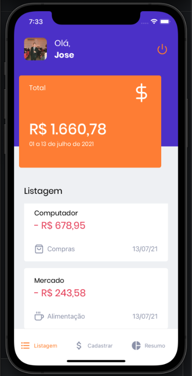
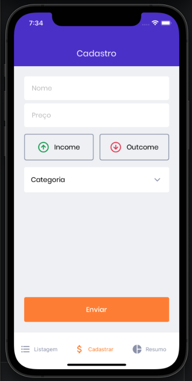
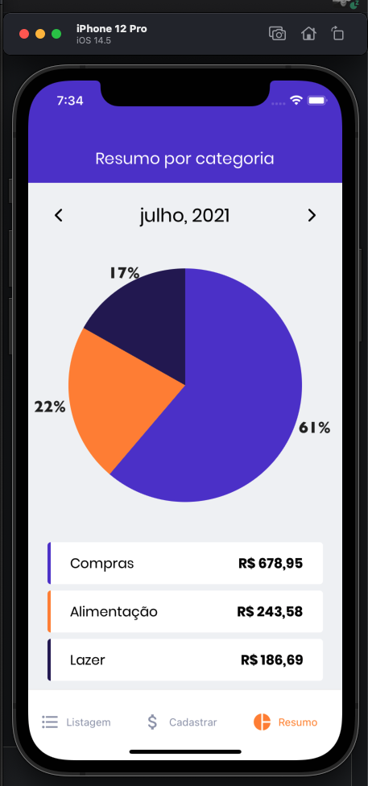

<h1 align="center">
     💵 GoFinances
</h1>

<h3 align="center">
    Seu app para gerenciar suas contas pessoais de forma simples.
</h3>

<p align="center">
  

  <a href="https://github.com/shuttzz/gofinances/commits/master">
    
  </a>

   
   <a href="https://github.com/shuttzz/gofinances/stargazers">
    
  </a>

  <a href="https://rocketseat.com.br">
    
  </a>

</p>

<h4 align="center">
	Concluído 🚀
</h4>

Tabela de conteúdos
=================
<!--ts-->
* [Sobre o projeto](#-sobre-o-projeto)
* [Funcionalidades](#-funcionalidades)
* [Layout](#-layout)
* [Imagens do App](#-imagens-app)
* [Pré-requisitos](#pré-requisitos)
* [Rodando o App](#user-content--rodando-o-backend-servidor)
* [Tecnologias](#-tecnologias)
* [Mobile](#user-content-mobile--react-native----typescript)
* [Como contribuir no projeto](#-como-contribuir-no-projeto)
* [Autor](#-autor)
* [Licença](#user-content--licença)
<!--te-->


## 💻 Sobre o projeto

💵 GoFinances - é um app para controle simples de suas finanças de forma a facilitar o controle dos seus gastos e também registras suas entradas assim obtendo na palma da sua mão todas as informações de suas finanças.


Projeto desenvolvido na trilha **React Native** do Ignite da [Rocketseat](https://blog.rocketseat.com.br/primeira-next-level-week/).

---

## ⚙️ Funcionalidades

- [x] As pessoas podem realizar o cadastro no app através do login com a conta Google ou Apple
- [x] Visualizar as movimentações que foram realizadas no mês, bem como verificar o total de entrada e saídas do mês
- [x] Realizar o cadastro de uma nova movimentação, podendo ser de entrada ou saída
- [x] Visualizar através de um gráfico todas as movimentações de saída de um mês de forma categorizada

---

## 🎨 Layout

O layout da aplicação está disponível no Figma:

<a href="https://www.figma.com/file/pxRXQ8bpw8YZGKe642cYSa/GoFinances-Ignite-(Copy)">
  
</a>


### Imagens do App

<p align="center">
  

  

  

  
</p>

---

### Pré-requisitos

Antes de começar, você vai precisar ter instalado em sua máquina as seguintes ferramentas:
[Git](https://git-scm.com), [Node.js](https://nodejs.org/en/).
Além disto é bom ter um editor para trabalhar com o código como [VSCode](https://code.visualstudio.com/)

#### 🎲 Rodando o App

```bash

# Clone este repositório
$ git clone git@github.com:shuttzz/gofinances.git

# Acesse a pasta do projeto no terminal/cmd
$ cd gofinances

# Instale as dependências
$ yarn install

# Execute a aplicação com o comando abaixo
$ yarn start

# E em outro terminal execute o expo
$ expo start

```
---

## 🛠 Tecnologias

As seguintes ferramentas foram usadas na construção do projeto:

#### **Mobile** ([React Native](https://reactnative.dev/) + [TypeScript](https://www.typescriptlang.org/))

-   **[Expo](https://expo.io/)**
-   **[Expo Google SignIn](https://docs.expo.io/versions/v42.0.0/sdk/google-sign-in/)**
-   **[Expo Apple Authentication](https://docs.expo.io/versions/v42.0.0/sdk/apple-authentication/)**
-   **[Expo Google Fonts](https://github.com/expo/google-fonts)**
-   **[React Navigation](https://reactnavigation.org/)**
-   **[React Native SVG](https://github.com/react-native-community/react-native-svg)**
-   **[Victory Native Charts](https://formidable.com/open-source/victory/docs/native/)**
-   **[Styled Components](https://styled-components.com/)**

> Veja o arquivo  [package.json](https://github.com/shuttzz/gofinances/blob/main/package.json)

---

## 💪 Como contribuir no projeto

1. Faça um **fork** do projeto.
2. Crie uma nova branch com as suas alterações: `git checkout -b my-feature`
3. Salve as alterações e crie uma mensagem de commit contando o que você fez: `git commit -m "feature: My new feature"`
4. Envie as suas alterações: `git push origin my-feature`
> Caso tenha alguma dúvida confira este [guia de como contribuir no GitHub](./CONTRIBUTING.md)

---

## 🦸 Autor

<a href="https://github.com/shuttzz">
 
 <br />
 <sub><b>José Assis de Menezes Neto</b></sub></a> <a href="https://blog.rocketseat.com.br/author/thiago/" title="Rocketseat">🚀</a>
 <br />

[](https://www.linkedin.com/in/jose-assis-menezes-neto-gyn/)
[](mailto:netomenezesucg@gmail.com)

---

## 📝 Licença

Este projeto esta sobe a licença [MIT](./LICENSE).

[Entre em contato!](https://www.linkedin.com/in/jose-assis-menezes-neto-gyn/)

---
